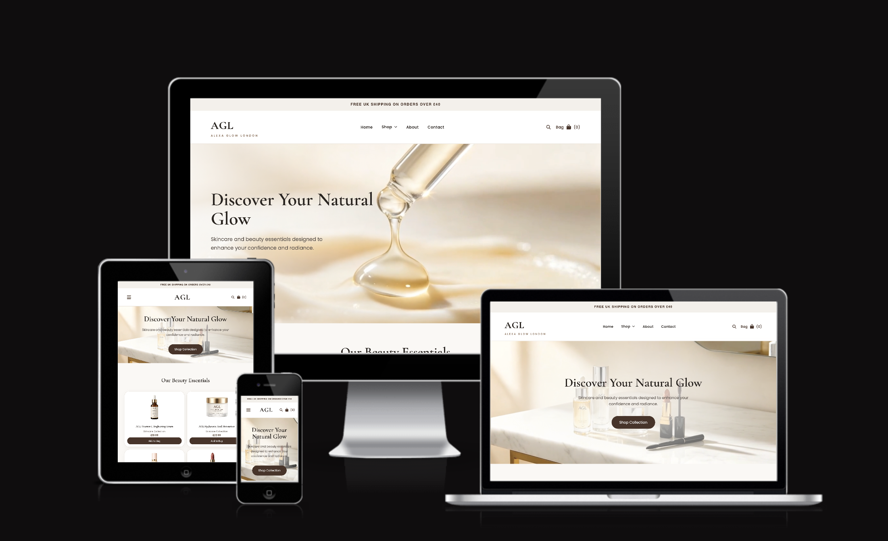

# AGL Beauty | Alexa Glow London

A front-end e-commerce website for a beauty and cosmetics brand, built with HTML, CSS, and vanilla JavaScript as the summative assignment for **CPU4104**.



## Student Information

- **Name:** [Alexandra Nastase]
- **Student ID:** [Your Student ID]
- **Module**: CPU4104
- **GitHub Repository:** [https://github.com/AlexandraNas/cosmetics-website]

## Project Overview

AGL Beauty is a fictional luxury skincare and cosmetics brand, and this project brings it to life as a working online shop front. Visitors can browse products by category, open a product to see the full description and ingredients, add items to a bag, adjust quantities, and go all the way through a mock checkout. There's no real backend or database behind any of it - everything runs in the browser, with the shopping bag saved through `localStorage` so it survives a page refresh or a trip between pages.

This is a demonstration project built for educational purposes. No real payments are taken and nothing is ever actually shipped.

## Features

**Home page**
- Sticky navigation bar with a dropdown menu and a mobile hamburger menu
- Hero banner with a background video
- "Shop by Collection" category cards linking straight into each section of the shop
- Featured products grid, with "New" badges on newly added products and an "Available in N shades" note on multi-shade products (foundation, lipstick)
- Newsletter signup and footer

**Product listing** (`products.html`)
- 16 products across 4 categories: Skincare, Makeup, Hair Care, and Beauty Tools
- Category filter buttons (All / Skincare / Makeup / Hair Care / Beauty Tools) that work together with a live search bar, showing a "no products found" message when nothing matches
- Products with more than one option (foundation, lipstick, mascara) show an "Available in N shades" note on the card; the actual shade and colour swatches live inside that product's modal, ringing the selected shade, updating the product photo, and showing the shade's name as you pick
- A full product detail view in a popup modal, with an image zoom on hover, a description, a checklist of key features (each with a small check-icon marker), and key ingredients shown as rounded pill tags

**Shopping bag** (`cart.html`)
- Add, remove, and adjust the quantity of items
- Live subtotal and total, with a free-shipping progress bar
- Saved with `localStorage`, so the bag doesn't empty itself if you leave the page

**Checkout** (`checkout.html`)
- Billing, delivery, and payment form with client-side validation
- Order summary with a live total
- Generates a mock order number and redirects to a confirmation page

**Other pages**
- About, Contact (with a validated enquiry form), FAQ, and Privacy Policy

**Accessibility & UX**
- Semantic HTML throughout, proper `header`, `nav`, `main`, and `footer` usage
- Descriptive `alt` text on images and `aria-label`s on icon-only buttons
- Visually-hidden labels on every form field, so inputs are properly labelled for screen readers even where the design only shows a placeholder
- Keyboard-accessible shade swatches inside each product modal, and keyboard-accessible modals overall
- A real, keyboard-operable search toggle button with a proper label, instead of relying on placeholder text alone
- Mobile-first layout that scales up cleanly from phone to tablet to desktop

## Technologies Used

- **HTML5** - semantic markup
- **CSS3** - a custom mobile-first stylesheet, no frameworks like Bootstrap or Tailwind
- **JavaScript (ES6)** - vanilla DOM manipulation only, no jQuery or libraries
- [Google Fonts](https://fonts.google.com/) - Cormorant Garamond and Poppins
- [Font Awesome](https://fontawesome.com/) - icons, loaded from a CDN

No backend, frameworks, or external JS libraries were used, in line with the assignment requirements.

## Folder Structure

```
AGL-Beauty/
│
├── index.html
├── products.html
├── cart.html
├── checkout.html
├── confirmation.html
├── about.html
├── contact.html
├── faq.html
├── policy.html
│
├── css/
│   └── style.css
│
├── js/
│   ├── bag.js          # shared bag/cart-count logic used on every page
│   ├── products.js     # product filtering, search, modals, shade swatches
│   ├── cart.js         # cart page: add/remove/quantity/total
│   ├── checkout.js     # checkout form validation + order summary
│   ├── confirmation.js # displays the generated order number
│   └── faq.js          # FAQ accordion toggle
│
├── media/
│   ├── images/         # product photos, banners
│   └── video/          # homepage hero background video
│
├── evidence/            # Lighthouse accessibility audit screenshots
│   ├── Problem1.png / Fix1.png
│   ├── Problem2.png / Fix2.png
│   └── Problem3.png / Fix3.png
│
├── Responsive.png          # README preview image
│   
│
└── README.md
```

## How to Run

This is a static front-end project, so there's no build step, server, or dependencies to install.

**Option 1 - Open directly**
1. Download or clone the project folder.
2. Open `index.html` in any modern browser.

**Option 2 - Live Server (recommended, so relative paths behave correctly)**
1. Open the project folder in VS Code.
2. Install the **Live Server** extension if you don't already have it.
3. Right-click `index.html` and choose **Open with Live Server**.
4. The site opens at `http://127.0.0.1:5500` (or similar) on the homepage.

From there, use the navigation bar to move between Home, Shop, About, Contact, and the Bag.

## Notes & Limitations

This is a front-end-only project - there's no real backend, database, or payment gateway behind it, and the checkout simply simulates placing an order. Since the bag is stored in the browser's `localStorage`, it'll be empty the first time the site is opened in a new browser, and clearing site data resets it. None of that affects how the site actually works or looks; it's just a reminder that nothing here is connected to a real store.

## Accessibility Testing

The site was audited with Google Chrome Lighthouse, and a couple of issues came up worth mentioning, along with how they were fixed. Before/after screenshots of two of these are in the `evidence/` folder (`Problem1.png`/`Fix1.png` and `Problem2.png`/`Fix2.png`).

The first was a link relying on colour alone to stand out. The "Privacy Policy" link inside the newsletter text only picked up an underline when hovered, meaning it looked identical to the surrounding paragraph the rest of the time - something that fails for anyone who can't rely on colour contrast to spot it as a link. It's now permanently underlined, with only the colour shifting slightly on hover, so it reads as a link at every moment, not just when someone's mouse happens to be over it.

The second was a heading order problem with the four category shortcut cards (Skincare, Makeup, Hair Care, Beauty Tools) - at the time shown on `products.html` - which jumped straight from the page's `<h1>` to `<h3>`, skipping `<h2>` entirely. That kind of gap breaks the outline that screen reader users navigate by, even though visually nobody would ever notice. The fix was simply changing those four headings to `<h2>`, so the page flowed `h1 → h2 → h3` with nothing skipped, and the CSS was updated to match so nothing looked any different. The cards have since been moved to the home page under a "Shop by Collection" heading, and the same non-skipping heading order was kept in the move.

A later audit of the deployed site on `products.html` flagged a third issue: the active state on the category filter buttons (All / Skincare / Makeup / Hair Care / Beauty Tools) used white text on a mid-tone tan background, which came out to roughly a 2.7:1 contrast ratio - well short of the 4.5:1 minimum for normal text. It's fixed by switching the active button's background to the same dark brown already used for the site's primary buttons and "New" badges, which brings the contrast up to around 11.7:1 and keeps the active filter visually consistent with the rest of the site's dark accent colour.

With all three of those fixed, Lighthouse now scores `products.html` at 100 for Performance, Accessibility, Best Practices, and SEO.

## Performance Optimization

Running Lighthouse on `cart.html` returned a performance score of 79, with most of it coming down to render-blocking requests (an estimated 2.77 seconds worth) and a related font-display warning. Before/after screenshots of this are in the `evidence/` folder (`Problem3.png`/`Fix3.png`).

The root cause was that the site's fonts were being pulled in through an `@import` rule inside `style.css`. `@import` makes the browser fully fetch and parse the whole stylesheet before it even discovers the font needs loading, which turns what should be a parallel download into one slow chain: HTML, then style.css, then the font CSS, then finally the font files. The Font Awesome icon stylesheet had the same problem, blocking the page's first paint even though each page only actually uses a handful of its icons.

Both were fixed the same way: fonts moved out of the CSS and into `<link rel="preconnect">` and `<link rel="stylesheet">` tags in each page's `<head>`, so the browser finds and fetches them straight away instead of waiting on the rest of the stylesheet. Font Awesome now loads through a non-blocking pattern (`media="print" onload="this.media='all'"`, with a `<noscript>` fallback for accessibility), so it no longer holds up rendering. None of this changes how anything looks - it's purely about load order.

## Academic Integrity

This project was created as a summative assignment for CPU4104 and is submitted as original work.